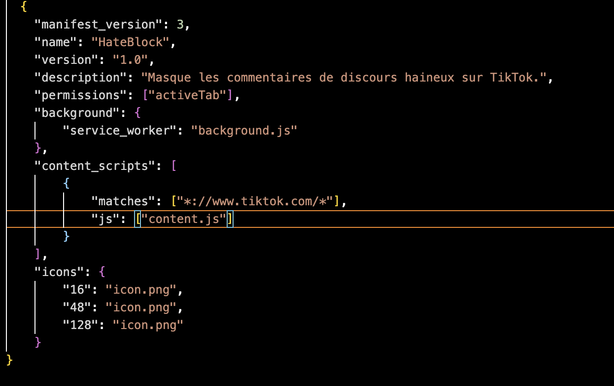
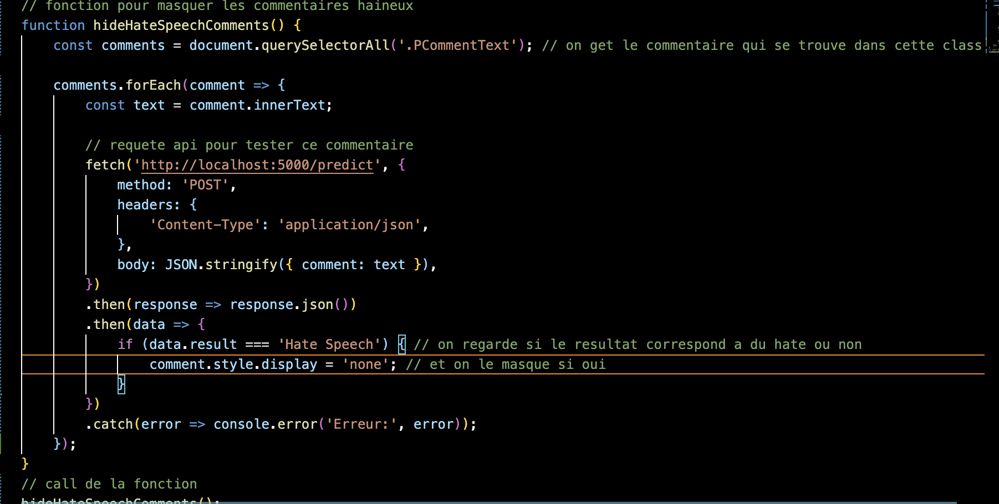
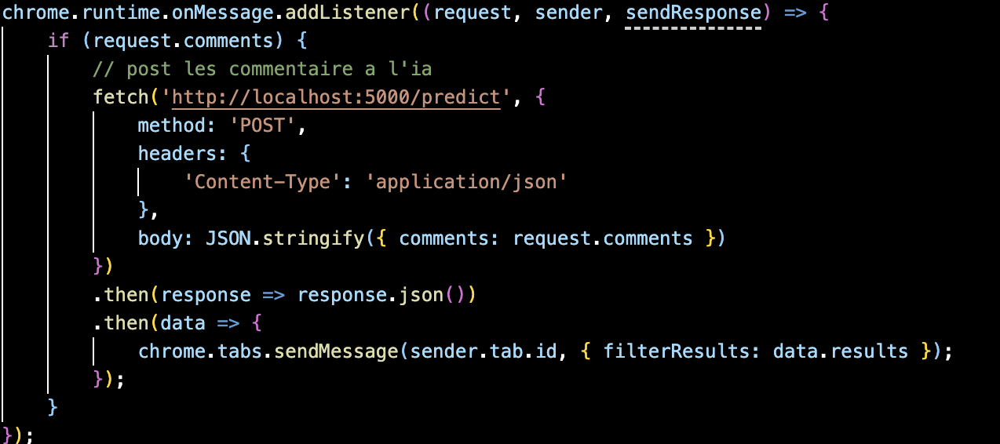

# HateBlock

## Description
**HateBlock** est une extension Chrome qui masque les commentaires de discours haineux sur TikTok. En utilisant un modèle d'IA pour analyser les commentaires, l'extension permet d'améliorer l'expérience utilisateur en cachant les contenus offensants.

## Fonctionnalités
- Masque les commentaires jugés haineux.
- Intégration avec un serveur Flask qui utilise un modèle de classification pour détecter le discours haineux.

## Fichiers de l'extension

### `manifest.json`
Ce fichier décrit les métadonnées de l'extension, les permissions requises et les scripts utilisés.

### `content.js`
Ce fichier contient le code pour masquer les commentaires haineux sur TikTok. Il envoie chaque commentaire à l'API pour déterminer s'il doit être masqué.

### `background.js`
Ce fichier gère la communication entre l'extension et le serveur Flask. Il envoie les commentaires à l'API et traite les résultats.

## Utilisation
1. Ouvrez TikTok dans Chrome.
2. Les commentaires seront automatiquement analysés pour détecter le discours haineux.
3. Les commentaires jugés haineux seront masqués sur la page.